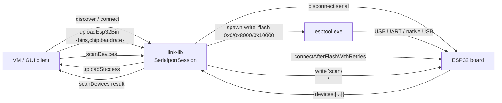

# ESP32 .bin flashing & device scan over the link server

> Status: design + implementation note for the upgrade in `src/upload/esp32.js` + `src/session/serialport.js`.
> Mirrors the WebSerial + esptool-js flow used by `hardware-console.jsx` (lines 430-754) but runs Node-side over `node-serialport` so the same flow is available to clients that cannot use Web Serial directly (Electron desktops, older Chromium-only browsers, headless test rigs).

## Why

`scratch-devices-link-lib` historically only handled Arduino AVR (compile via `arduino-cli`, flash via avrdude). The existing GUI in `Windify Robo Scratch GUI` already flashes ESP32 directly from the browser using `ESPLoader` / `Transport` over Web Serial after fetching the three `.bin` files. This document records how the same end-to-end pipeline is provided server-side via the link server, so any VM/GUI can:

1. Send a pre-built triple `{bootloader, partitions, firmware}.bin` to the link server.
2. Have the server flash the ESP32 attached to a local serial port.
3. Re-establish the serial session and run a `scan` device discovery whose JSON payload is forwarded back over JSON-RPC.

## End-to-end flow



## Reuse of existing tools

`npm run fetch` extracts a Windows/macOS/Linux `winblock-tools` archive that already contains an esptool standalone binary, so no new dependency is shipped:

- Windows: `tools/Arduino/packages/esp32/tools/esptool_py/<ver>/esptool.exe`
- macOS / Linux: `tools/Arduino/packages/esp32/tools/esptool_py/<ver>/esptool`

The version directory is resolved at runtime by `Esp32._resolveEsptoolBinary()` so a version bump in `winblock-tools` does not require a code change.

## JSON-RPC API additions

Both methods are added to `src/session/serialport.js` `didReceiveCall`. The session must already be `connect`ed (a `discover` followed by a successful `connect` is the prerequisite, just like the existing `upload` flow).

### `uploadEsp32Bin`

Request `params`:

```jsonc
{
  "chip": "esp32s3",            // optional, default "esp32s3"
  "baudrate": 921600,           // optional esptool baud, default 921600
  "eraseAll": false,            // optional, --erase-all flag
  "flashMode": "dio",           // optional, --flash_mode
  "flashFreq": "80m",           // optional, --flash_freq
  "flashSize": "keep",          // optional, --flash_size
  "addresses": {                // optional override; defaults below
    "bootloader": 0,
    "partitions": 32768,        // 0x8000
    "firmware":   65536         // 0x10000
  },
  "bins": {
    "bootloader": { "encoding": "base64", "data": "..." },
    "partitions": { "encoding": "base64", "data": "..." },
    "firmware":   { "encoding": "base64", "data": "..." }
  }
}
```

Each `bins.*` entry can also be `{ "path": "<absolute path on the host>" }` for the case where the file is already on the local disk (e.g. it was downloaded by another component such as the Windify Backend `/esp32s3/compile` zip extractor).

Server-side flow:

1. `_emitSetUploadAbortEnabled(true)` so the GUI can show an Abort button.
2. `disconnect()` the existing serial port to release it for esptool.
3. Materialise the three bins into `<userDataPath>/esp32_flash_<id>/`.
4. Spawn esptool:
   ```
   esptool --chip <chip> --port <peripheralId> --baud <baud> \
     --before default_reset --after hard_reset \
     write_flash --flash_mode <mode> --flash_freq <freq> --flash_size <size> \
     0x0 bootloader.bin 0x8000 partitions.bin 0x10000 firmware.bin
   ```
5. Stream stdout/stderr through `sendstd(text, normalizedProgress)`. Progress is parsed from `Writing at 0x... (xx %)` lines using the same `_flashProgressFromText` heuristic the AVR flow uses.
6. After exit code 0, call `_connectAfterFlashWithRetries()` (already in the file) — it refreshes the discovery cache and retries `port.open` up to 12 times because USB-native ESP32 chips re-enumerate after reset.
7. Emit `uploadSuccess` with `{aborted, kind:'esp32'}`.
8. On failure: `uploadError` and, if the device disappeared, `peripheralUnplug`.
9. `cleanup()` deletes the temp bin directory regardless of outcome.

### `scanDevices`

Request `params` (all optional):

```jsonc
{
  "command":  "scan",   // string written to the peripheral
  "terminator": "\n",   // appended to command
  "timeoutMs": 10000    // resolves with reject('scan timeout') if no JSON arrives
}
```

Response `result`: `{ devices: [...] }` (the JSON object emitted by the firmware after the scan command).

Server-side flow (mirrors the GUI's `_jsonBuffer` logic at `hardware-console.jsx:566-607`):

1. Validate `this.peripheral && this.peripheral.isOpen`.
2. Install a transient hook into `onMessageCallback`: every chunk is appended to `this._scanBuffer`. When the buffer contains a balanced `{ ... }` JSON, attempt `JSON.parse`. If the parsed object has `devices: Array`, resolve.
3. Write `command + terminator` to the peripheral.
4. After `timeoutMs`, reject and clear the hook.
5. Existing `read`/`onMessage` streaming is **not** disabled — when scanning is active, chunks are forwarded to both the scan accumulator and any subscribed reader.

## Abort

`abortUpload` already exists. The new `Esp32` class implements `abortUpload()` to:

- Set `this._abort = true`.
- On Windows, `taskkill /pid <pid> /f /t` (matches the AVR pattern).
- On POSIX, send SIGTERM.

The existing `_emitSetUploadAbortEnabled(true)` toggle around `uploadEsp32Bin` lets the GUI show the same Abort button it already has for AVR uploads.

## Mapping vs `hardware-console.jsx:430-754`

| GUI step | Link-lib equivalent |
| --- | --- |
| `_reader.cancel/release`, `_writer.releaseLock`, `_port.close` (450-468) | `this.disconnect()` at start of `uploadEsp32Bin` |
| Build `flashMap` and base64-decode 3 files (475-510) | Done client-side; `_writeBinsToTemp` writes them to disk |
| `_flashToESP32`: ESPLoader main → eraseFlash → writeFlash → hardReset (652-708) | `esptool write_flash --before default_reset --after hard_reset`, optional `--erase-all` |
| Retry `port.open` 3-5 times (538-552) | `_connectAfterFlashWithRetries` (already implemented, 12 attempts × 450ms) |
| `writeToPeripheral('scan')` + 10s timeout + balanced-JSON parser (566-607) | `scanDevices({command:'scan', timeoutMs:10000})` |
| `_handleDeviceDisconnect` on `disconnected/not found` (618-619) | Existing `peripheralUnplug` branch in `upload` error path |

## Risks

- esptool binary path is version-specific (`4.9.dev3` today). The resolver scans `esptool_py/*/esptool*` so a `winblock-tools` bump does not need code changes.
- USB-OTG / USB-JTAG-Serial chips can require the user to hold BOOT before flashing. The link server cannot push that prompt itself; clients should keep showing the same hint they already show in the GUI when `chip` is set to `esp32s3` and the device fails to enter download mode.
- Concurrent `uploadEsp32Bin` and `scanDevices` calls are not allowed: scan requires the serial port open, esptool requires it closed. The session enforces this naturally because both methods take the existing serial lock.

## Test plan

1. `npm run fetch && npm start` to ensure `esptool[.exe]` is on disk and the link server boots.
2. Run `node test/test-esp32-flash.js` (added by this change) which:
   - Connects to `ws://127.0.0.1:11337/winblock/serialport`.
   - Calls `discover` → `connect` for the ESP32 COM port.
   - Reads three `.bin` paths from CLI args, base64-encodes them, sends `uploadEsp32Bin`.
   - Verifies `uploadStdout` progress chunks and `uploadSuccess` arrive.
   - Calls `scanDevices` and asserts the result has a `devices` array.
3. `npm run lint`.
